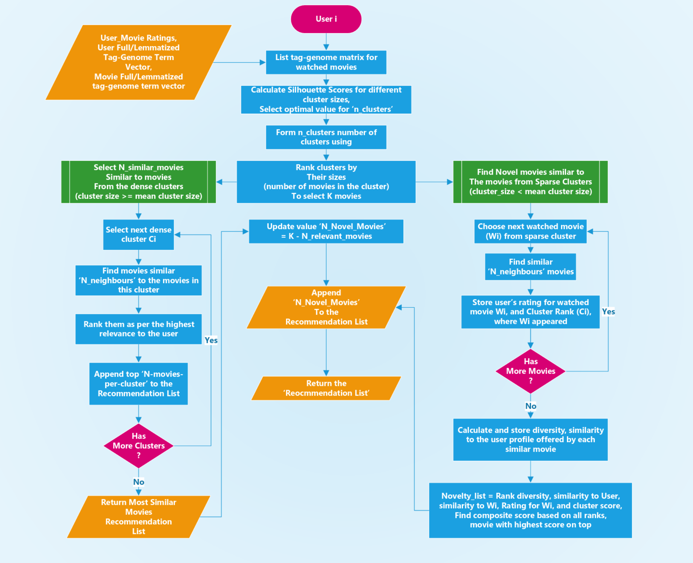

# README #

### Who do I talk to? ###

* Aniruddha Kalburgi [LinkedIn](https://www.linkedin.com/in/anikalburgi/), [Twitter](https://twitter.com/AniKalburgi)

End to end Run's aren't possible yet.
Optimizing and refactoring some parts to speed up further research. Will add end-to-end run and the documentation soon.

### Recommendation Flow Diagram for each user:

---------------------------------------
TODO:
---------------------------------------

### What is this repository for? ###

* Quick summary
* Version
* [Learn Markdown](https://bitbucket.org/tutorials/markdowndemo)

### How do I get set up? ###

* Summary of set up
* Configuration
* Dependencies
* Database configuration
* How to run tests
* Deployment instructions

### Contribution guidelines ###

* Writing tests
* Code review
* Other guidelines
